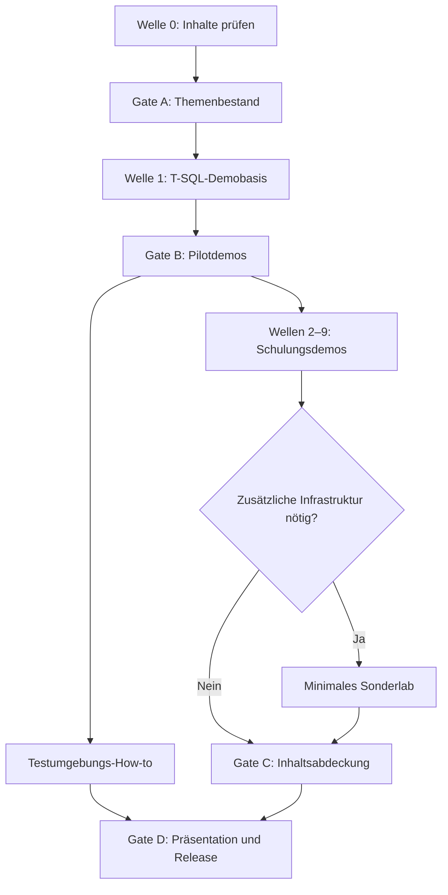

# Master-Umsetzungsplan – SQL-Server-Performance-Schulung

| Merkmal | Wert |
|---|---|
| Status | `PLANNED` |
| Planversion | 1.1 |
| Stand | 2026-07-24 |
| Primäre Zielplattform | SQL Server 2025 |
| Kompatibilitätsmatrix | SQL Server 2019, 2022 und 2025 |
| Bevorzugtes Demonstrationsmittel | T-SQL |
| Verbindlicher Datenschutzstatus | ausschließlich synthetische und firmenneutrale Inhalte |

## 1. Zweck dieses Plans

Dieser Plan beschreibt die vollständige Umsetzung des Schulungsprojekts so detailliert, dass eine spätere Bearbeitung ohne Rekonstruktion der bisherigen Überlegungen begonnen oder fortgesetzt werden kann. Er konkretisiert die Wellen aus [`.ai/ROADMAP.md`](../../.ai/ROADMAP.md), ersetzt aber weder die verbindlichen Projektregeln noch den Demo-Vertrag.

Der Plan erzeugt selbst noch keine Demo-Skripte, Infrastrukturdefinitionen oder Präsentationen. Er legt Arbeitspakete, Reihenfolge, Abhängigkeiten, erwartete Artefakte, Prüfschritte und Abschlusskriterien fest.

## 2. Verbindlicher Ausgangspunkt

Vor jeder Bearbeitung sind in dieser Reihenfolge zu lesen:

1. [`.ai/PROJECT_CONTEXT.md`](../../.ai/PROJECT_CONTEXT.md)
2. [`.ai/PROJECT_RULES.md`](../../.ai/PROJECT_RULES.md)
3. [`.ai/DECISIONS.md`](../../.ai/DECISIONS.md)
4. [`.ai/DEMO_CONTRACT.md`](../../.ai/DEMO_CONTRACT.md)
5. [`.ai/ROADMAP.md`](../../.ai/ROADMAP.md)
6. dieses Dokument
7. [`.ai/BACKLOG.md`](../../.ai/BACKLOG.md)

Die Repository-Grundstruktur wurde mit Commit `25bc970d8b9bb6d4519e52e3d5ab85e85c1c5e66` angelegt. Dieser Commit ist nur die technische Ausgangsbasis; der fachliche und ausführbare Inhalt ist noch zu erstellen.

## 3. Zielzustand

Das Projekt ist abgeschlossen, wenn folgende Artefaktgruppen konsistent vorliegen:

- ein fachlich validiertes Curriculum mit Einsteigerpfad und Expertenvertiefungen,
- eine bereinigte, firmenneutrale Präsentation mit Quellen, Sprecherhinweisen und Demo-Zuordnung,
- ein vollständiger Demo-Katalog mit stabilen IDs,
- reproduzierbare T-SQL-Demos mit Setup, Evidenz, Gegenmaßnahme, Vergleich und Cleanup,
- reproduzierbare T-SQL-Demos, die ihre isolierten synthetischen Testdatenbanken selbst aufbauen und bereinigen,
- ein kompaktes Testumgebungs-How-to für Personen ohne verfügbaren SQL Server,
- zusätzliche Container- oder Hyper-V-Szenarien ausschließlich für fachlich begründete Sonderfälle,
- statische und dynamische Tests für Datenschutz, Struktur, Syntax, Wiederholbarkeit und Versionsverhalten,
- Trainer- und Teilnehmerhinweise für Durchführung, Interpretation und Fehlerbehebung,
- ein Releasepaket mit nachvollziehbarer Versions- und Quellenbasis.

## 3.1 Verbindliche Umsetzungsreihenfolge

Die Schulungsinhalte bestimmen die technische Umsetzung, nicht umgekehrt:

1. Das Thema wird fachlich erklärt und einem überprüfbaren Lernziel zugeordnet.
2. Die Vorführung wird als T-SQL-Demo in einer isolierten synthetischen Testdatenbank entworfen.
3. Die Testdatenbank wird durch Setup und Cleanup reproduzierbar aufgebaut und entfernt.
4. Erst wenn die Kernaussage damit nicht glaubwürdig, sicher oder messbar gezeigt werden kann, wird zusätzliche Infrastruktur vorgesehen.
5. Ein Testumgebungs-How-to bleibt ein unterstützender Bereitstellungspfad und ist kein eigener fachlicher Schwerpunkt.

Zusätzliche Infrastruktur benötigt im Demo-Katalog eine Begründung: welcher Effekt ohne sie fehlt, welche minimale Topologie erforderlich ist und warum eine reine T-SQL-Variante nicht genügt.

## 4. Nichtziele

- Kein Bestandteil dieses Projekts darf ein anderes Repository verändern.
- Es werden keine realen Diagnoseausgaben, Screenshots, Namen, Logos, Hostnamen, Datenbanknamen, Pfade oder Organisationsinformationen versioniert.
- Dieses Projekt baut kein Lab für ein anderes Analyseframework auf.
- Infrastruktur wird nicht vorsorglich aufgebaut, wenn eine T-SQL-Demo mit Testdatenbank ausreicht.
- Ein gemessener Effekt auf einer Labormaschine wird nicht als universeller Schwellenwert dargestellt.
- Rot eingestufte Demos werden nicht für Produktionssysteme freigegeben.
- Drittanbieter-Werkzeuge werden nicht ungeprüft eingebettet oder stillschweigend vorausgesetzt.

## 5. Steuerungsmodell

### 5.1 Statuswerte

Jedes Arbeitspaket und jede Demo verwendet genau einen Status:

| Status | Bedeutung |
|---|---|
| `PROPOSED` | vorgesehen, fachlicher Zuschnitt noch offen |
| `RESEARCHED` | Quellen und Versionsgrenzen sind geprüft |
| `DESIGNED` | Ablauf, Datenmodell, Evidenz und Tests sind festgelegt |
| `IMPLEMENTED` | Artefakte sind vorhanden, aber noch nicht vollständig validiert |
| `VALIDATED` | zutreffende Tests und fachliches Review sind erfolgreich |
| `RELEASED` | in einer freigegebenen Schulungsfassung enthalten |
| `BLOCKED` | Fortsetzung benötigt eine dokumentierte Entscheidung oder Voraussetzung |
| `DEFERRED` | bewusst zurückgestellt; Begründung ist dokumentiert |

### 5.2 Größenklassen

- `S`: einzelne, klar begrenzte Änderung ohne neue Infrastruktur.
- `M`: eine vollständige Demo oder ein begrenztes Querschnittsmodul.
- `L`: mehrere abhängige Artefakte oder Multi-Session-/Versionslogik.
- `XL`: eigener Infrastruktur- oder Präsentations-Workstream; zwingend in kleinere PRs aufteilen.

### 5.3 Definition of Ready

Ein Arbeitspaket darf implementiert werden, wenn:

- Ziel und Nichtziel eindeutig formuliert sind,
- Datenschutz- und Sicherheitsstufe feststehen,
- betroffene Versionen, Compatibility Levels, Editionen und Betriebssysteme benannt sind,
- Quellenlage und offene fachliche Fragen dokumentiert sind,
- erwartete Evidenz und Messmethode feststehen,
- Abhängigkeiten erfüllt oder als kontrollierte Annahmen dokumentiert sind,
- der geplante Cleanup den Ausgangszustand wiederherstellt.

### 5.4 Definition of Done

Ein Arbeitspaket gilt als erledigt, wenn:

- alle vorgesehenen Artefakte im Repository vorhanden sind,
- Inhalte und Metadaten den Datenschutzregeln entsprechen,
- technische Aussagen auf belastbare Quellen oder klar gekennzeichnete Messungen gestützt sind,
- Setup und Cleanup mindestens zweimal hintereinander erfolgreich ausgeführt wurden,
- alle zutreffenden Tests erfolgreich sind,
- versions- oder editionsbedingte Skip-Regeln begründet sind,
- Dokumentation, Demo-Katalog und Status gemeinsam aktualisiert wurden,
- bekannte Grenzen und Abbruchbedingungen dokumentiert sind.

## 6. Kritischer Pfad und Gates

### Gate A – Fachlicher Bestand freigegeben

- Quelleninventar vollständig.
- Reale oder interne Inhalte sind ausgeschlossen oder sanitisiert.
- Aussagenregister mit `KEEP`, `REFINE`, `REPLACE` oder `REMOVE` gepflegt.
- Fehlende Themen priorisiert.
- Vorläufige Demo-IDs und Curriculum-Zuordnung vorhanden.

### Gate B – Demo-Framework belastbar

Vier Pilotdemos müssen den vollständigen Vertrag erfüllen:

1. eine grüne Single-Session-Demo,
2. eine grüne Plan-/Statistik-Demo,
3. eine gelbe Multi-Session-Blocking-Demo,
4. eine gelbe Ressourcen-Demo mit Abbruchkriterien.

Erst danach werden größere Mengen fachlicher Demos umgesetzt.

### Gate C – Inhaltliche Abdeckung vollständig

- Jeder freigegebene Schulungsabschnitt besitzt mindestens eine Erklärung oder Demo.
- Jede Demo ist einem Curriculum- und Präsentationsabschnitt zugeordnet.
- Überschneidungen wurden bewusst zusammengeführt oder begründet getrennt.
- Alle Demos besitzen Version, Risiko, Laufzeitklasse und Ausführungsvoraussetzung; Standard ist T-SQL mit isolierter Testdatenbank.
- Jede zusätzliche Infrastrukturabhängigkeit ist fachlich begründet.

### Gate D – Releasefähig

- Statische Prüfungen vollständig grün.
- Alle grünen Demos in der zutreffenden Versionsmatrix validiert.
- Gelbe und rote Demos in den tatsächlich benötigten isolierten Profilen validiert.
- Das Testumgebungs-How-to ermöglicht die Ausführung der normalen T-SQL-Beispiele ohne bereits vorhandenen SQL Server.
- Nicht benötigte Sonderinfrastruktur ist ausdrücklich `DEFERRED` und blockiert den Release nicht.
- Präsentation, Sprecherhinweise, Teilnehmeranleitung und Demo-Katalog stimmen überein.
- Release- und Wiederherstellungsanleitung geprüft.

## 7. Welle 0 – Inventar, Datenschutz und fachliche Konsolidierung

### Ziel

Alle vorhandenen Schulungsunterlagen und Beispiele werden nachvollziehbar erfasst, datenschutzsicher klassifiziert und fachlich gegen aktuelle Primärquellen geprüft. In dieser Welle werden noch keine vorhandenen Office-Dateien unverändert veröffentlicht.

### Arbeitspakete

| ID | Größe | Arbeit | Ergebnis / Abnahme |
|---|---:|---|---|
| `W0-001` | M | Quellenmanifest für Folien, Dokumente und Beispiele erstellen | Hash, Typ, Umfang, Herkunftsklasse, Privacy-Status und Importentscheidung je Quelle |
| `W0-002` | M | Privacy- und Metadatenprüfung definieren | Prüfliste für sichtbaren Inhalt, Notes, Alt-Text, Office-Metadaten, eingebettete Objekte, Bilder und Exporte |
| `W0-003` | L | Themen- und Aussagenregister erstellen | Jede relevante Aussage erhält Quelle, Folienbezug, Versionsgrenze und Status `KEEP/REFINE/REPLACE/REMOVE` |
| `W0-004` | L | Kritische Bestandsaussagen prüfen | Mindestens CTE, Table Variables, Fill Factor, Partition-Metadaten, Isolation, Columnstore, CE, Filegroups und Memory Grants vollständig bewertet |
| `W0-005` | M | Fehlende Themen bewerten | Priorisierte Gap-Liste mit Lernwert, Demo-Eignung, Aufwand, Risiko und Versionsbezug |
| `W0-006` | M | Quellenregister strukturieren | Primärquelle, Aktualisierungsdatum, Abrufdatum, Aussagebezug und Gültigkeitsbereich je Eintrag |
| `W0-007` | S | Begriffs- und Schreibstandard festlegen | Einheitliche Terminologie, deutsche Erklärung und unveränderte etablierte Fachbegriffe |
| `W0-008` | M | Konflikt- und Entscheidungslog einführen | Offene fachliche Widersprüche werden nicht stillschweigend aufgelöst |

### Besonders zu prüfende Themen

- CTE-Ausführung und mögliche Spool-Operatoren,
- lesende und schreibende Zugriffe auf Table Variables,
- Deferred Compilation und Compatibility Level,
- Fill Factor, Page Density, Page Splits und Fragmentation,
- korrekte Interpretation von `index_id` und Partition-Metadaten,
- RCSI gegenüber SNAPSHOT und Update-Konflikte,
- versionsabhängige Columnstore-Funktionen,
- Cardinality-Estimation-Modelle gegenüber Feedback-Funktionen,
- tatsächliche Wirkung von Filegroups ohne getrennte physische I/O-Pfade,
- grantable memory, Required/Desired/Requested/Granted/Used Memory,
- Threads, Tasks, Workers, Schedulers und Partitionierung,
- produktive Relevanz und Grenzen undokumentierter Diagnosefunktionen.

## 8. Querschnitt A – Curriculum und Nachverfolgbarkeit

Dieser Workstream beginnt nach `W0-003` und läuft bis zum Release.

| ID | Größe | Arbeit | Abschlusskriterium |
|---|---:|---|---|
| `CUR-001` | M | Zielgruppen und Vorwissen definieren | Einsteiger, Entwicklung, Administration und Vertiefung klar abgegrenzt |
| `CUR-002` | L | Modulreihenfolge entwerfen | Abhängigkeiten zwischen Storage, Optimizer, Query Patterns, Indizes, Concurrency, Ressourcen und Diagnose berücksichtigt |
| `CUR-003` | M | Lernziele je Modul formulieren | beobachtbare und prüfbare Lernziele statt Themenüberschriften |
| `CUR-004` | M | Einsteiger- und Expertenpfad kennzeichnen | gemeinsamer Kern, optionale Vertiefung und notwendiges Vorwissen sichtbar |
| `CUR-005` | L | Traceability-Matrix pflegen | Quelle → Aussage → Curriculum → Folie → Demo → Test vollständig zuordenbar |
| `CUR-006` | M | Zeit- und Durchführungsvarianten entwerfen | Kurz-, Standard- und Vertiefungsformat mit auslassbaren Blöcken |
| `CUR-007` | M | Übungen und Verständnisfragen planen | Aufgabe, erwartete Beobachtung, Fehlannahmen und Musterlösung je Kernmodul |
| `CUR-008` | S | Erfolgskriterien definieren | praktische und theoretische Lernkontrolle dokumentiert |

## 9. Querschnitt B – Demo-Katalog und Benennung

### ID-Schema

| Präfix | Themenbereich |
|---|---|
| `FWK` | gemeinsames Demo-Framework |
| `STL` | Storage, Pages und Transaction Log |
| `OPT` | Optimizer, Statistics und Execution Plans |
| `QRY` | Query Patterns |
| `IDX` | Rowstore und Columnstore |
| `CON` | Concurrency, Isolation und TempDB |
| `RES` | CPU, Memory, I/O und Waits |
| `DGN` | Diagnosewerkzeuge |
| `INF` | Testumgebungs-How-to und notwendige Sonderinfrastruktur |

IDs werden nach Veröffentlichung nicht neu nummeriert. Entfernte Kandidaten bleiben im Katalog als `DEFERRED` oder `RETIRED` sichtbar.

### Pflichtfelder des Katalogs

- ID, Titel, Status und Themenbereich,
- Lernziel und fachliche Kernaussage,
- Curriculum- und Präsentationsbezug,
- Version, Compatibility Level, Edition und Betriebssystem,
- Sicherheitsstufe und Ausführungspfad (`TSQL_TESTDB`, `CONTAINER`, `HYPERV` oder begründete Alternative),
- Zahl der Sessions, Laufzeitklasse und erwarteter Speicherbedarf,
- Setup-, Evidenz-, Mitigation- und Cleanup-Pfad,
- automatisierbare und manuelle Tests,
- Quellenstatus, letzter Test und bekannte Grenzen.

## 10. Welle 1 – Gemeinsames Demo-Framework

### Ziel

Wiederverwendbare Bausteine verhindern, dass jede Demo eigene Sicherheits-, Mess- und Cleanup-Logik erfindet.

| ID | Größe | Arbeit | Abschlusskriterium |
|---|---:|---|---|
| `FWK-001` | M | Preflight-Vertrag | Version, Edition, Compatibility Level, Rechte, Konfiguration, freier Speicher und Eignung der Testinstanz werden geprüft |
| `FWK-002` | M | Testdatenbank-Lifecycle | idempotente Anlage, eindeutige Kennzeichnung, Schutz vor falscher Zieldatenbank und vollständiges Entfernen |
| `FWK-003` | L | synthetischer Datengenerator | deterministische Seeds, skalierbare Zeilenzahl, Skew-, Korrelations- und Breitenprofile |
| `FWK-004` | L | Messrahmen | CPU, Duration, Reads, Writes, Rows, Grants, Wait-Deltas und Dateilatenzen themengerecht erfassbar |
| `FWK-005` | M | Plan- und Statistik-Evidenz | Estimated/Actual Plan, relevante XML-Warnings, Statistikheader und Histogramme versionsbewusst dokumentierbar |
| `FWK-006` | M | Multi-Session-Orchestrierung | Sessionreihenfolge, Barrieren, Timeouts, Abbruch und Recovery eindeutig |
| `FWK-007` | M | Query-Store- und XE-Helfer | isolierte Aktivierung, Datenerfassung, Export synthetischer Evidenz und Cleanup |
| `FWK-008` | M | Sicherheits- und Abbruchrahmen | Grün/Gelb/Rot, Ressourcenbudgets, Kill-Switch und Wiederherstellung geprüft |
| `FWK-009` | S | Demo-Dokumentvorlage | alle Pflichtfelder aus dem Demo-Vertrag enthalten |
| `FWK-010` | M | Test-Harness | Setup, Baseline, Demo, Mitigation, Comparison und Cleanup automatisiert aufrufbar |
| `FWK-011` | M | Ergebnisnormalisierung | hardwareabhängige Bereiche, relationale Erwartungen und versionierte Golden-Metadaten statt fragiler Fixwerte |
| `FWK-012` | S | Fehler- und Skip-Vertrag | erwartete Skips von echten Fehlern unterscheidbar; Ursache und Voraussetzung werden ausgegeben |

### Pilotabnahme

Die vier Demos für Gate B werden erst im Detail ausgewählt, wenn Welle 0 abgeschlossen ist. Empfohlene Kandidaten sind SARGability, Statistik-Skew, Blocking Chain und kontrollierter Memory-Grant-/Spill-Effekt.

## 11. Welle 2 – Vorhandene Beispiele modernisieren

| ID | Größe | Arbeit | Abschlusskriterium |
|---|---:|---|---|
| `W2-001` | M | Bestandsbeispiele klassifizieren | `REUSE`, `REFACTOR`, `REBUILD`, `DIAGNOSTIC_ONLY` oder `REMOVE` je Beispiel |
| `W2-002` | L | interne Abhängigkeiten entfernen | ausschließlich synthetische Datenbanken, Tabellen, Werte und neutrale Bezeichnungen |
| `W2-003` | L | Beispiele in Demo-Vertrag überführen | Preflight, Setup, Baseline, Evidenz, Mitigation, Vergleich und Cleanup vorhanden oder begründet entfallen |
| `W2-004` | M | Diagnoseabfragen modernisieren | Version, Rechte, Scope, Delta-Methodik und Messgrenzen dokumentiert |
| `W2-005` | M | bestehende Kernaussagen neu messen | Effekt reproduzierbar; veraltete oder zufällige Effekte werden ersetzt |
| `W2-006` | M | Mapping zu neuen IDs | kein Beispiel bleibt außerhalb von Katalog und Curriculum |

## 12. Wellen 3 bis 9 – Geplanter Demo-Bestand

Die folgende Liste definiert 68 geplante fachliche Demo-Bündel. Welle 10 ergänzt sechs unterstützende oder bedarfsabhängige Infrastruktur-Bündel; diese zählen nicht als eigenständige Schulungsthemen. Ein Bündel darf während des Designs in mehrere Demos geteilt werden, wenn Sicherheitsstufe, Version oder didaktischer Ablauf sonst unklar werden. Zusammenlegungen benötigen eine dokumentierte Begründung, damit keine Kernaussage verloren geht.

### Welle 3 – Storage, Pages und Transaction Log

| ID | Demo-Bündel | Standardrisiko |
|---|---|---|
| `STL-001` | Page- und Row-Aufbau, Slot Array, NULL Bitmap und Wirkung der Zeilenbreite | Grün |
| `STL-002` | IN_ROW_DATA, ROW_OVERFLOW_DATA und LOB_DATA | Grün |
| `STL-003` | Heap, RID, Forwarded Records und Lookup-Kosten | Grün |
| `STL-004` | Allocation Units, Extents und Page-Metadaten | Grün |
| `STL-005` | Files, Filegroups, Proportional Fill und Autogrowth | Rot |
| `STL-006` | Buffer Pool, Cold/Warm Cache sowie Logical und Physical Reads | Gelb |
| `STL-007` | Log Records, Commit, Rollback und Checkpoint | Grün |
| `STL-008` | VLF-Struktur und geplantes gegenüber ungeplantem Logwachstum | Rot |
| `STL-009` | kleine Commits, Batch-Commit und `WRITELOG` | Gelb |
| `STL-010` | NONE-, ROW-, PAGE- und Columnstore-Kompression: Größe, CPU und I/O | Gelb |

### Welle 4 – Optimizer, Statistics und Execution Plans

| ID | Demo-Bündel | Standardrisiko |
|---|---|---|
| `OPT-001` | Estimated gegenüber Actual Plan und Schätzfehler | Grün |
| `OPT-002` | Statistikheader, Histogramm und Density Vector | Grün |
| `OPT-003` | Sampling, Fullscan, Skew und Histogrammgrenzen | Grün |
| `OPT-004` | Spaltenkorrelation, Constraints und Eindeutigkeit als Optimizer-Wissen | Grün |
| `OPT-005` | Ascending Key sowie synchrone und asynchrone Statistikpflege | Grün |
| `OPT-006` | Cardinality-Estimation-Modelle und versionsabhängiges Feedback | Grün |
| `OPT-007` | Compilation, Recompilation, Plan Reuse und Ad-hoc-Cache-Pollution | Gelb |
| `OPT-008` | Parameter Sniffing und stabile Reproduktion von Daten-Skew | Grün |
| `OPT-009` | Parameter Sensitive Plan Optimization und Versionsvergleich | Grün |
| `OPT-010` | Optional Parameter Plan Optimization und Alternativen auf älteren Versionen | Grün |
| `OPT-011` | Row Goals durch `TOP`, `FAST n` und `EXISTS` | Grün |
| `OPT-012` | Nested Loops, Merge und Hash Join mit veränderter Kardinalität | Grün |
| `OPT-013` | Sort-, Hash- und Exchange-Spills | Gelb |
| `OPT-014` | Required, Desired, Requested, Granted und Used Memory sowie Memory Grant Feedback | Gelb |

### Welle 5 – Query Patterns

| ID | Demo-Bündel | Standardrisiko |
|---|---|---|
| `QRY-001` | SARGable und Non-SARGable Prädikate einschließlich Funktionen auf Indexspalten | Grün |
| `QRY-002` | Implicit Conversion, Datentyp- und Collation-Mismatch | Grün |
| `QRY-003` | halboffene Datumsintervalle und Datentypgenauigkeit | Grün |
| `QRY-004` | optionale Parameter: statisches SQL, Recompile, dynamisches SQL und adaptive Varianten | Grün |
| `QRY-005` | `OR` gegenüber geeigneten `UNION ALL`-Varianten | Grün |
| `QRY-006` | NULL-Semantik, `NOT IN`, `NOT EXISTS`, Semi und Anti Semi Join | Grün |
| `QRY-007` | `DISTINCT`, `UNION`, `UNION ALL` und `SELECT *` als Kosten- oder Modellierungsindikator | Grün |
| `QRY-008` | CTE, Temp Table und Table Variable mit versionsabhängiger Optimierung | Grün |
| `QRY-009` | Inline TVF, Multi-Statement TVF und Scalar UDF mit und ohne Inlining | Grün |
| `QRY-010` | `APPLY`, Window Functions, Cursor und set-based Verarbeitung | Gelb |
| `QRY-011` | Computed Column, Filtered Index und Predicate Implication | Grün |
| `QRY-012` | Partition Elimination, Remote Pushdown sowie messbare JSON/XML/String-Kosten | Gelb |

### Welle 6 – Rowstore und Columnstore

| ID | Demo-Bündel | Standardrisiko |
|---|---|---|
| `IDX-001` | Heap gegenüber Clustered Index | Grün |
| `IDX-002` | Breite und Eindeutigkeit des Clustered Key sowie Uniquifier | Grün |
| `IDX-003` | Key-Reihenfolge, Left-Based Prefix und INCLUDE | Grün |
| `IDX-004` | Covering, Key/RID Lookup und Tipping Point | Grün |
| `IDX-005` | redundante/überlappende Indizes und DML-Kosten | Gelb |
| `IDX-006` | Page Splits, Page Density, Fragmentation und Fill Factor | Gelb |
| `IDX-007` | Sequential-Key-Insert, Last-Page-Contention und geeignete Gegenmaßnahmen | Gelb |
| `IDX-008` | Row-/Page-Compression mit Größen-, CPU- und I/O-Trade-off | Gelb |
| `IDX-009` | Columnstore-Interna: Delta Store, Rowgroups, Delete Bitmap und Direct Compressed Load | Gelb |
| `IDX-010` | Segment Elimination, geordnete Columnstore-Varianten und Maintenance | Gelb |

### Welle 7 – Concurrency, Isolation und TempDB

| ID | Demo-Bündel | Standardrisiko |
|---|---|---|
| `CON-001` | Dirty Read, Non-repeatable Read, Phantom und Lost-Update-Szenarien | Gelb |
| `CON-002` | READ COMMITTED, REPEATABLE READ und SERIALIZABLE einschließlich Key-Range Locks | Gelb |
| `CON-003` | RCSI, SNAPSHOT, Statement-/Transaction-Snapshot und Update-Konflikt | Gelb |
| `CON-004` | Blocking Chain, Head Blocker und messbare Wartezeit | Gelb |
| `CON-005` | Lock Escalation, Schema Locks und Metadatenzugriff | Gelb |
| `CON-006` | reproduzierbarer Deadlock mit Deadlock Graph | Gelb |
| `CON-007` | Version Store, ADR und Persisted Version Store | Gelb |
| `CON-008` | versionsabhängiges Optimized Locking, TID Locks und Lock After Qualification | Gelb |
| `CON-009` | TempDB-Allocation-Contention und Memory-optimized TempDB Metadata | Gelb |

### Welle 8 – CPU, Memory, I/O und Waits

| ID | Demo-Bündel | Standardrisiko |
|---|---|---|
| `RES-001` | CPU-bound Query, Worker, Scheduler und `SOS_SCHEDULER_YIELD` | Gelb |
| `RES-002` | Parallelism Overhead, DOP und Parallel Skew | Gelb |
| `RES-003` | Memory Pressure gegenüber Query Execution Memory und `RESOURCE_SEMAPHORE` | Rot |
| `RES-004` | Overgrant, Undergrant, Spill und konkurrierende Grants | Gelb |
| `RES-005` | `PAGEIOLATCH_*` gegenüber `PAGELATCH_*` | Rot |
| `RES-006` | Log- und Datenfile-Latenz, `WRITELOG` und Dateistatistik-Deltas | Rot |
| `RES-007` | Wait-Stat-Deltas, Request-/Task-Waits und `ASYNC_NETWORK_IO` | Gelb |

### Welle 9 – Diagnosewerkzeuge

| ID | Demo-Bündel | Standardrisiko |
|---|---|---|
| `DGN-001` | `STATISTICS IO/TIME`, Actual Plan und kontrollierter A/B-Vergleich | Grün |
| `DGN-002` | Session-, Request- und Task-DMVs sowie Live Query Statistics | Grün |
| `DGN-003` | Query Store: Regression, mehrere Pläne, Runtime- und Wait-Historie | Grün |
| `DGN-004` | Plan Forcing, Query Store Hints und sichere Rücknahme | Gelb |
| `DGN-005` | Extended Events für Deadlocks, Blocking, Spills, Recompiles und Fehler | Gelb |
| `DGN-006` | Workload-Treiber, hohe Sessionzahl, OS-Metriken und reproduzierbare Baselines | Gelb |

## 13. Welle 10 – Testumgebungs-How-to und notwendige Sonderinfrastruktur

### 13.1 Rolle dieser Welle

Welle 10 ist kein eigenständiger fachlicher Schwerpunkt und kein Lab für ein Analyseframework. Sie unterstützt die Ausführung der Schulungsbeispiele in zwei klar getrennten Fällen:

1. Es steht kein SQL Server zur Verfügung. Dann wird ein kompakter, ressourcenschonender Bereitstellungspfad angeboten.
2. Eine konkrete Schulungsdemo benötigt nachweislich CPU-/RAM-Limits, gedrosseltes I/O, Netzwerkbedingungen, mehrere Instanzen oder Windows-nahe Messung. Dann wird nur die dafür notwendige minimale Topologie umgesetzt.

### 13.2 Verbindlicher Entscheidungspfad je Demo

| Stufe | Ausführungspfad | Verwendung |
|---:|---|---|
| 1 | vorhandene Testinstanz plus eigene synthetische Testdatenbank | Standard, wenn ein geeigneter SQL Server verfügbar ist |
| 2 | reine T-SQL-Steuerung innerhalb der isolierten Testinstanz | bevorzugt für Pläne, Statistiken, Indizes, Blocking, Deadlocks, Query Store und Extended Events |
| 3 | containerisierte Einzelinstanz | Bereitstellung, wenn kein SQL Server vorhanden ist, oder reproduzierbare CPU-/RAM-Grenzen benötigt werden |
| 4 | Hyper-V-VM | nur für Windows-, OS-, Storage- oder Isolationsanforderungen, die Stufe 1 bis 3 nicht abdecken |
| 5 | Mehrinstanz-/Netzwerktopologie | nur bei fachlich notwendiger verteilter oder netzwerkabhängiger Kernaussage |

Für jede Stufe oberhalb von 2 wird im Demo-Katalog dokumentiert, warum die niedrigere Stufe nicht genügt.

### 13.3 Unterstützende Bündel

| ID | Bündel | Rolle |
|---|---|---|
| `INF-001` | How-to für vorhandene Instanz und isolierte synthetische Testdatenbank | primärer Ausführungspfad |
| `INF-002` | kompakter Docker-Bereitstellungspfad, wenn kein SQL Server vorhanden ist | optionaler Quickstart |
| `INF-003` | geprüfte Podman-Desktop-Variante desselben Quickstarts | wichtigste Alternative |
| `INF-004` | Hyper-V-Bereitstellungspfad für notwendige Windows-/OS-Szenarien | bedarfsabhängig |
| `INF-005` | CPU-/RAM-Limits für konkret zugeordnete Ressourcen-Demos | bedarfsabhängig |
| `INF-006` | I/O-, Log-, Netzwerk- oder Mehrinstanz-Topologie | ausschließlich nach fachlicher Begründung |

### 13.4 Inhalt des Testumgebungs-How-tos

Das How-to beschreibt mindestens:

- Auswahl zwischen vorhandener Instanz, Docker, Podman und Hyper-V,
- Mindestvoraussetzungen und erwartete Ressourcenbelegung,
- sichere lokale Credential-Bereitstellung ohne Repository-Secrets,
- Start, Healthcheck, Verbindung und Versionserkennung,
- Anlage und Entfernung der synthetischen Schulungsdatenbank,
- Ausführung der Demo-Preflights,
- Stop, Reset, Cleanup und Recovery,
- Unterschiede zwischen SQL Server 2019, 2022 und 2025,
- klare Kennzeichnung, welche Schulungsdemos zusätzliche Infrastruktur benötigen.

### 13.5 Container-Arbeitspakete

| ID | Größe | Arbeit | Abschlusskriterium |
|---|---:|---|---|
| `INF-C01` | M | minimaler Quickstart | eine Einzelinstanz ist ohne proprietäre Daten mit Healthcheck start- und entfernbar |
| `INF-C02` | M | gemeinsame Compose-Basis | Docker und Podman verwenden soweit möglich dieselbe neutrale Spezifikation |
| `INF-C03` | M | Versionsprofile | 2019, 2022 und 2025 werden nacheinander statt gleichzeitig betrieben |
| `INF-C04` | M | Testdatenbank-Integration | T-SQL-Setup und Cleanup funktionieren identisch auf vorhandener und containerisierter Instanz |
| `INF-C05` | M | optionale Ressourcenprofile | CPU-/RAM-Limits werden nur implementiert, wenn eine zugeordnete Demo sie benötigt |
| `INF-C06` | M | wirksame Sonderlimits | I/O- oder Netzwerkbegrenzungen gelten nur nach gemessener Wirksamkeit als unterstützt |

### 13.6 Hyper-V-Arbeitspakete

| ID | Größe | Arbeit | Abschlusskriterium |
|---|---:|---|---|
| `INF-H01` | M | Entscheidung und Host-Preflight | Hyper-V-Einsatz ist durch mindestens eine konkrete Demo begründet |
| `INF-H02` | L | ressourcenschonender VM-Lifecycle | Create, Start, Stop, Reset und Remove sind reproduzierbar |
| `INF-H03` | M | differenzierende Diskstrategie | Basisimage und Testzustände verbrauchen möglichst wenig zusätzlichen Storage |
| `INF-H04` | L | benötigte Storage-/OS-Topologie | nur die von zugeordneten Demos benötigten Datenträger und Messpfade werden gebaut |
| `INF-H05` | M | Recovery | jede Änderung besitzt Rücksetzpunkt, Cleanup und Notfallpfad |

### 13.7 Entscheidungsmatrix nach Themenart

| Themenart | T-SQL/Testdatenbank ausreichend? | Zusätzliche Infrastruktur |
|---|---|---|
| SARGability, Pläne, Statistiken, Joins, Indizes, Kompression | normalerweise ja | nein |
| Blocking, Isolation und Deadlocks | ja, mit mehreren Sessions | nein |
| Query Store und Extended Events | normalerweise ja | nein |
| Spills und Memory Grants | meist ja | nur wenn ein stabiler Engpass sonst nicht entsteht |
| CPU- oder gesamter Instanz-Memory-Druck | teilweise | Container- oder VM-Limit kann erforderlich sein |
| echter physischer Daten-/Log-I/O-Engpass | nein | gedrosselter Datenträger oder geeignete VM-Topologie |
| Netzwerk-Latenz oder Bandbreite | nein | begrenzter Netzwerkpfad |
| Windows-spezifische OS-Metriken | nein | Hyper-V-VM |
| Failover oder Secondary Workload | nein | begründete Mehrinstanztopologie |

### 13.8 Ressourcenziel

- Für normale Entwicklung wird nur eine SQL-Server-Version gleichzeitig gestartet.
- Synthetische Testdaten werden reproduzierbar generiert und nicht als große Datenbankdateien eingecheckt.
- Container-Volumes und virtuelle Disks besitzen einen dokumentierten Reset- und Cleanup-Pfad.
- Mehrinstanz-, Netzwerk- und Storageprofile werden erst bei einer konkreten fachlichen Abhängigkeit gebaut.
- Messwerte werden nur innerhalb desselben Ressourcenprofils verglichen.
- Eine nicht benötigte Sondertopologie darf `DEFERRED` bleiben und blockiert die übrige Schulung nicht.

## 14. Querschnitt C – Präsentation und Lehrmaterial

Dieser Workstream beginnt erst nach Gate A; finale Folien werden nach Gate C fertiggestellt.

| ID | Größe | Arbeit | Abschlusskriterium |
|---|---:|---|---|
| `PRS-001` | M | neutrales Designsystem | keine Logos/Firmeninformationen; zugängliche Farben, Typografie und Layoutregeln |
| `PRS-002` | L | fachliche Folienbereinigung | jede geprüfte Aussage korrekt, versionsbewusst und ohne pauschale Tuning-Regel |
| `PRS-003` | L | Demo-Integration | Demo-ID, Ausgangslage, Beobachtungsauftrag, Evidenz und Take-away je Vorführung |
| `PRS-004` | L | Sprecherhinweise | Ablauf, Zeitbedarf, Stolperstellen, erwartete Abweichungen und Recovery je Demo |
| `PRS-005` | M | Teilnehmerunterlage | Lernziele, Schlüsselbegriffe, Übungen und Referenzen ohne interne Informationen |
| `PRS-006` | M | Visualisierungen | nur eigene, synthetische oder nachweislich zulässige Assets; Quellenstatus dokumentiert |
| `PRS-007` | M | Barrierefreiheit | Lesbarkeit, Kontrast, Alt-Text und sinnvolle Lesereihenfolge geprüft |
| `PRS-008` | M | Render- und Metadatenprüfung | Folien, Notes, Alt-Text, eingebettete Objekte, Vorschauen und Exportdateien geprüft |
| `PRS-009` | M | Zeitvarianten | Kurz-, Standard- und Vertiefungsdeck aus derselben fachlichen Basis ableitbar |
| `PRS-010` | M | Generalprobe | vollständiger Ablauf einschließlich Start-, Abbruch- und Recovery-Pfade getestet |

## 15. Querschnitt D – Test- und Qualitätsautomatisierung

### 15.1 Testklassen

| Klasse | Inhalt | Ausführung |
|---|---|---|
| Static | Pfade, Namensschema, Links, Pflichtdateien und verbotene Muster | bei jeder Änderung |
| Privacy | Text, Metadaten, Bilder, Logs, erwartete Resultate und Secrets | bei jeder Änderung |
| Contract | Demo-Phasen, Statusfelder, Quellen, Risiko und Cleanup | bei jeder Demoänderung |
| Syntax | T-SQL parse/deploy und Hilfswerkzeug-Syntax | bei jeder relevanten Änderung |
| Runtime Green | Setup, zweimalige Ausführung, Mitigation und Cleanup | automatisiert |
| Runtime Yellow | begrenzte Ressourcen-/Concurrency-Tests | geplant oder manuell freigegeben |
| Runtime Red | Infrastruktur- und Instanzänderungen | ausschließlich isoliertes Lab |
| Presentation | Render, Links, Fonts, Alt-Text und Metadaten | bei Präsentationsänderungen |

### 15.2 Versionsstrategie

- Für schnelle Entwicklung wird primär SQL Server 2025 verwendet.
- Vor Freigabe eines versionsübergreifenden Arbeitspakets wird die zutreffende Matrix 2019/2022/2025 ausgeführt.
- Feature-spezifische Demos müssen auf älteren Versionen kontrolliert mit begründetem `SKIP` reagieren.
- Betriebssystem- und editionsgebundene Pfade werden getrennt getestet.
- Container-Tags, Produktverfügbarkeit und Compatibility Levels werden vor Implementierung gegen aktuelle Primärquellen geprüft und nicht dauerhaft angenommen.

### 15.3 Qualitätsarbeitspakete

| ID | Größe | Arbeit | Abschlusskriterium |
|---|---:|---|---|
| `TST-001` | M | Repository-Strukturtest | alle verbindlichen Pfade, IDs und Links geprüft |
| `TST-002` | L | Privacy-Scanner | Text- und Office-Metadaten, Bilder, Secrets und reale Bezeichner soweit technisch erkennbar geprüft |
| `TST-003` | M | Demo-Contract-Linter | Pflichtphasen und Pflichtmetadaten automatisch geprüft |
| `TST-004` | L | SQL-Runtime-Harness | Versionserkennung, Setup, Ausführung, Timeout, Resultat und Cleanup standardisiert |
| `TST-005` | M | Idempotenz- und Cleanup-Test | zwei vollständige Läufe hinterlassen denselben definierten Ausgangszustand |
| `TST-006` | L | Versionsmatrix | Feature-Matrix, kontrollierte Skips und Ergebnisse zentral dokumentiert |
| `TST-007` | M | Concurrency-Harness | Sessions, Barrieren, Timeouts und Notfall-Cleanup deterministisch |
| `TST-008` | M | Performance-Erwartungsvertrag | relationale Erwartungen und Bandbreiten statt maschinenabhängiger Fixwerte |
| `TST-009` | M | Infrastruktur-Smoke-Test | Erstellen, Healthcheck, Demo-Bereitschaft, Reset und Entfernen geprüft |
| `TST-010` | M | Office-/PDF-Renderprüfung | visuelle Integrität, Links, Notes und Metadaten geprüft |

## 16. Querschnitt E – Dokumentation, Quellen und Betrieb

| ID | Größe | Arbeit | Abschlusskriterium |
|---|---:|---|---|
| `DOC-001` | M | Testumgebungs-How-to | vorhandene Instanz und isolierte Testdatenbank zuerst; Docker/Podman als Quickstart, Hyper-V nur bedarfsabhängig |
| `DOC-002` | M | Trainer-Runbook | Startreihenfolge, Zeitplan, Abbruch, Reset und bekannte Abweichungen |
| `DOC-003` | M | Teilnehmer-Runbook | sichere Ausführung grüner Demos und Beobachtungsaufträge |
| `DOC-004` | M | Troubleshooting | Symptom, Ursache, Prüfung und Recovery für erwartbare Labfehler |
| `DOC-005` | M | Versions- und Feature-Matrix | Produktversion, Compatibility Level, Edition, OS und Demostatus |
| `DOC-006` | S | Drittanbieterregister | Werkzeugtyp, Herstellerquelle, Lizenz, Version, Zweck und Alternative |
| `DOC-007` | M | Quellenpflegeprozess | veraltete Links, geändertes Produktverhalten und Revalidierungsdatum |
| `DOC-008` | S | Glossar | fachlich genaue Begriffe mit Verweisen zu Demos und Curriculum |

## 17. Umsetzungspakete und Parallelisierung

Nach Gate B können folgende Stränge unabhängig bearbeitet werden:

- Welle 3 und Welle 6 teilen Datenmodell- und Storage-Abhängigkeiten und sollten koordiniert werden.
- Welle 4 und Welle 5 können parallel laufen, verwenden aber gemeinsam `FWK-003` bis `FWK-005`.
- Welle 7 benötigt `FWK-006` und sollte vor ressourcenintensiven Multi-Session-Demos aus Welle 8 stabil sein.
- Welle 9 beginnt früh mit Pilotwerkzeugen, wird aber erst nach den Fachdemos vollständig abgeschlossen.
- Das Basis-How-to aus Welle 10 kann nach Gate B erstellt werden. Sonderinfrastruktur wird erst bearbeitet, wenn eine konkrete Demo ihre Notwendigkeit nachweist.
- Präsentationsarbeit kann nach Gate A beginnen, die finale Demo-Integration wartet auf Gate C.

Empfohlene Änderungseinheit ist ein klar begrenztes Framework-Modul oder eine vollständige Demo einschließlich Dokumentation und Tests. Große Themenwellen werden nicht als einzelner unprüfbarer Commit umgesetzt.

## 18. Priorisierte Startreihenfolge

1. `W0-001` Quellenmanifest und `W0-002` Privacy-Verfahren.
2. `W0-003` Aussagenregister und `W0-004` kritische Fachprüfung.
3. `CUR-001` bis `CUR-005` sowie Demo-ID-Vergabe.
4. `FWK-001` bis `FWK-012` als kleine, abhängige Pakete.
5. Vier Pilotdemos und Gate B.
6. Welle 2: vorhandene Beispiele klassifizieren und migrieren.
7. Wellen 3–6: Storage, Optimizer, Query Patterns und Indizes.
8. Wellen 7–9: Concurrency, Ressourcen und Diagnose.
9. Kompaktes Testumgebungs-How-to bereitstellen; nur fachlich notwendige Sonderinfrastruktur ergänzen.
10. Präsentationsintegration, Generalprobe und Releaseabnahme.

## 19. Wiederaufnahmeprotokoll

Bei jeder späteren Fortsetzung ist folgender Ablauf verbindlich:

1. Readme-Reihenfolge aus Abschnitt 2 vollständig lesen.
2. Aktuellen `main`-Commit, offene PRs und laufende Branches prüfen.
3. Im Backlog den obersten `READY`-Punkt wählen, dessen Abhängigkeiten erfüllt sind.
4. Zugehörige Demo-Katalogzeile, Quellen und letzte Testergebnisse lesen.
5. Datenschutzprüfung vor jeder Datei- oder Git-Operation durchführen.
6. Status auf `DESIGNED` oder `IMPLEMENTED` nur mit zugehörigem Artefakt ändern.
7. Relevante Tests ausführen und Ergebnisse ohne reale Umgebungsdaten dokumentieren.
8. Demo-Katalog, Backlog, Quellenregister und gegebenenfalls Entscheidungen gemeinsam aktualisieren.
9. Am Ende festhalten: letzter abgeschlossener Punkt, nächster ausführbarer Punkt, Blocker, Teststatus und betroffene Versionen.

### Übergabeformat

Jede Arbeitsübergabe enthält mindestens:

- letzter geprüfter Commit,
- bearbeitete IDs,
- aktueller Status je ID,
- geänderte Artefakte,
- ausgeführte Tests und Ergebnis,
- nicht ausgeführte Tests mit Begründung,
- bekannte Risiken oder fachliche Unsicherheiten,
- nächster ausführbarer Schritt,
- explizite Blocker oder benötigte Entscheidungen.

## 20. Aktueller Ausführungsmarker

| Feld | Stand |
|---|---|
| Repository-Struktur | abgeschlossen |
| Fachliche Demos | noch nicht implementiert |
| Testumgebungs-How-to | noch nicht implementiert; unterstützt später die Ausführung ohne vorhandenen SQL Server |
| Sonderinfrastruktur | nicht begonnen; nur bei konkreter fachlicher Notwendigkeit |
| Präsentationsbasis | neutraler fachlicher Neuaufbau mit 84 Folien auf `main`; finale Demo-Integration nach Gate C offen |
| Welle 0 – abgeschlossen | `W0-001` Quellenmanifest; `W0-002` Privacy- und Metadaten-Prüfverfahren; `W0-003` Themen-/Aussagenregister; `W0-004` kritische Fachprüfung |
| Aussagenstatus | 84/84 Folien erfasst; 80 `KEEP`, 4 `REFINE`; 26 kritische Themen vertieft geprüft |
| Nächstes Arbeitspaket | `CUR-001` bis `CUR-005` – Lernziele, Module, Rollen, Demo-Zuordnung und Traceability |
| Danach | Demo-ID-Namensstandard und Framework-Arbeitspakete `FWK-001` bis `FWK-012` |
| Aktueller Blocker | keiner für den Curriculum-Workstream; vier dokumentierte Folienpräzisierungen folgen kontrolliert in `W2-007`; Altbeispiele bleiben bis `W2-001` inaktiv |

## 21. Abschluss-Checkliste des Gesamtprojekts

- [ ] Alle Arbeitspakete besitzen einen Endstatus mit Evidenz.
- [ ] Alle freigegebenen Aussagen sind quellen- oder messungsbasiert.
- [ ] Der Demo-Katalog deckt Curriculum und Präsentation vollständig ab.
- [ ] Alle Demos erfüllen den Demo-Vertrag oder dokumentieren begründete Ausnahmen.
- [ ] Alle Beispieldaten und sichtbaren Bezeichnungen sind synthetisch.
- [ ] Präsentationen enthalten keine Firmeninformationen, Logos oder realen Metadaten.
- [ ] Das Testumgebungs-How-to besitzt Preflight, Setup, Reset, Cleanup und Recovery.
- [ ] Jede umgesetzte Sonderinfrastruktur ist einer Demo zugeordnet und ihre Notwendigkeit begründet.
- [ ] Die zutreffende SQL-Server-Matrix ist erfolgreich oder besitzt begründete Feature-Skips.
- [ ] Grüne, gelbe und rote Demos sind sicher getrennt.
- [ ] Trainer- und Teilnehmermaterial stimmen mit den ausführbaren Demos überein.
- [ ] Quellen, Drittanbieter-Abhängigkeiten und Lizenzen sind nachvollziehbar.
- [ ] Eine Generalprobe des vollständigen Schulungsablaufs wurde dokumentiert.
- [ ] Releaseartefakte wurden auf Inhalt, Metadaten, Links und Wiederherstellbarkeit geprüft.
